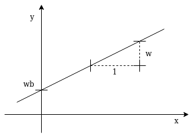

# The Artificial Neuron

The Artificial Neuron is inspired by its natural counterpart.
A natural [Neuron](https://en.wikipedia.org/wiki/Neuron) consists of the Soma which is the center of the Neuron cell and contains the cell Nucleus.
A lot of [Dendrits](https://en.wikipedia.org/wiki/Dendrite) - something like branched trees - receive information from other Neurons via [Synapses](https://en.wikipedia.org/wiki/Synapse) and pass this information to the [Soma](https://en.wikipedia.org/wiki/Soma_(biology)) of the Neuron which sums up all this information.
If the activation (sum of information) of the Soma exceeds a threshold, the Neuron fires which means it sends this activation energy through the [Axon](https://en.wikipedia.org/wiki/Axon).
The Axon is a long isolated connector to Synapses which again connect to other Neurons Dendrites or directly to a Neurons Soma.
The Synapses and Dendrides have different connectivity strengths and therefore operate like information transportation weights.
The fire rate (spike rate) of a Neuron depends on the Soma activation in a non-linear way.

{:.caption .img}

Structure of an Artificial Neuron

The Artificial Neuron is constructed in a similar manner.
It has weighted input paths which get summed up including a weighted bias value.
This bias value models the activation threshold and serves as an input independent offset value.
The sum value is then passed through an activation function which - in most cases - is a non-linear function.
This simple structure is the base element which Neural Networks are made of.

## A Linear Function Model

Given an input vector $$x$$, the input weights vector $$w_x$$ and a constant scalar bias value $$b = 1$$ together with its weight $$w_b$$, the following equation describes the Artificial Neuron.

$$y = f_a(dotproduct(w_x, x) + w_b * b)$$

$$f_a$$ is the activation function which transforms the summed value into the Neuron output value $$y$$.

The most simple Artificial Neuron has only one weighted input path, a weighted bias value, the sum element and a linear activation function.

$$y = w_x * x + w_b$$

In this case $$w_x$$, $$x$$, $$w_b$$, $$b$$ and $$y$$ are all scalar values.
The equation looks like a one-dimensional linear function with gain $$w_x$$ and offset $$w_b$$ ... and yes ... an Artificial Neuron with only one scalar input can be used to model a linear function.

{:.caption .img}

A Linear Function with Gain $$w_x$$ and Offset $$w_b$$

## How the Artifical Neuron Learns

Learning - even for a Neuron - is a step by step adaption process according an error (function) which represents the distance between desired and actual output.

The objective is to optimize the error by adjusting the Neuron parameters in a way that the error gets smaller.
The error is a multidimensional function depending on the Neuron parameters (its weights) and its input values.
Its a landscape we have to descent - step by step - towards its minimum.

To determine the direction of the optimal descent we have to calculate the gradient - meaning the partial derivative of the error function - at the point we are at the moment.
The gradient always points towards the ascending direction which means we have to step exactly towards the opposite direction and repeat this procedure until we reach a minimum.

Unfortunately this minimum can be a local one or a plateau and the optimal global minimum may be far away and unreachable behind huge error mountains.

