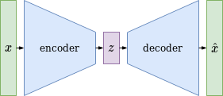

# Autoencoder

{:.caption}

Autoencoder Structure

An autoencoder is a structure which encodes a high dimensional input dataset into a low dimensional - bottleneck - latent space representation from which a decoder is used to reconstruct the original input data. The idea behind this structure is to find the main underlying features of a dataset, which represent its characteristics and may show up as latent space features. Both the encoder and decoder can be implemented using neural networks, which learn a latent space representation by optimizing the reconstruction error of data passed through this structure. The post by [Joseph Rocca](https://towardsdatascience.com/@joseph.rocca) perfecly shows, that even a 1-dimensional latent space can represent each complex dataset by heavily overfitting it. A classical autoencoder is trained without any mechanism of latent space regularisation and after training the decoder can most probably not be used without unexpected effects to generate new output data from latent space vectors which the decoder has not seen before during training. Thats the point where [Variational Autoencoders (VAEs)](variational_autoencoder.html) come into play ...

## The Up-Convolution Layer

## Autoencoder Implementation

{:.caption}
<video controls poster="/assets/videos/autoencoder_four_classes_tanh.png">
  <source src="/assets/videos/autoencoder_four_classes_tanh.webm" type="video/webm">
  <source src="/assets/videos/autoencoder_four_classes_tanh.ogv" type="video/ogg">
  <source src="/assets/videos/autoencoder_four_classes_tanh.mp4" type="video/mp4">
</video>
Autoencoder without Latent Space Regularization (Tanh activation)

{:.caption}
<video controls poster="/assets/videos/autoencoder_four_classes_leaky_relu.png">
  <source src="/assets/videos/autoencoder_four_classes_leaky_relu.webm" type="video/webm">
  <source src="/assets/videos/autoencoder_four_classes_leaky_relu.ogv" type="video/ogg">
  <source src="/assets/videos/autoencoder_four_classes_leaky_relu.mp4" type="video/mp4">
</video>
Autoencoder without Latent Space Regularization (LeakyReLU activation)

