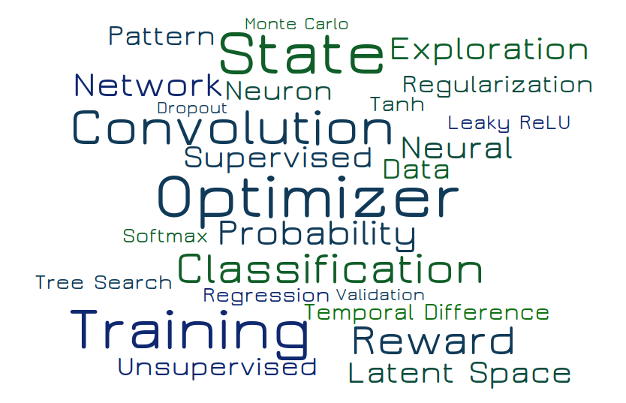

# A Machine Learning Compendium

At the time I was studying Microelectronics and Computer Science I had the opportunity to take some fascinating machine learning lectures.
Since that time I have followed this topic up to now where the research in neural networks and machine learning gains a lot of momentum.

>Please see the <a href="#" class="show-nav-bar">navigation menu for details on machine learning and neural networks</a>, their usage for regression, prediction, and classification problems, for reinforcement learning, generative models and many other interesting fields.

{:.caption}

My interest in all the things surrounding this field of research and the growing amount of available publications led me to the decision to - once again - dive deeper into it.

To understand all the things down to their details, I decided to implement all components of neural networks including the optimization environment from scratch using Python and the NumPy library.

So I started based on my knowledge about neural networks as they were the days I studied, combining it with the latest research outcomes regarding new activation functions, new optimizer algorithms and new network structures, altogether better suited to solve several problems.

As a nice side effect I got a better understanding of Python, NumPy, and PyTorch later on.

