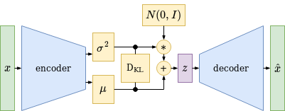

# Variational Autoencoder (VAE)

{:.caption .img}

Variational Autoencoder Structure

A Variational AutoEncoder is trained like a normal autoencoder to minimize the reconstruction loss, but in addition the latent space representation of the dataset is optimized to form a gaussian normal distribution with zero mean and unit variance. This can be done by using the [Kullback-Leibler Divergence](https://en.wikipedia.org/wiki/Kullback%E2%80%93Leibler_divergence#Multivariate_normal_distributions) that calculates the distance between two probability distributions and allows to miminize this distance by gradient descent with respect to the encoder parameters. To get a robust latent space representation, latent space vectors are sampled using a gaussian distribution and the decoder is optimized to correctly map these sampled latent space vectors to the original target vectors. This adds a stochastic element to the learning process and prevents the VAE - together with the latent space regularisation - from overfitting. As a result - after training - the decoder can be used to generate new, better interpolated and more meaningful output data from unseen latent space vectors.

## Deriving the Kullback-Leibler Divergence Loss

The Kullback-Leibler Divergence between the encoder output multivariate normal distribution

$$p(z \vert x) = \mathcal{N}(z \vert \mu_x, \Sigma_x) = \mathcal{N}(\mu_0, \Sigma_0)$$

and the desired zero mean unit variance latent space normal distribution

$$p(z) = \mathcal{N}(0, \pmb{I}) = \mathcal{N}(\mu_1, \Sigma_1)$$

is defined as

$$
D_{KL}(\mathcal{N}_0 \vert\vert \mathcal{N}_1) = \frac{1}{2} \left(
tr(\Sigma_1^{-1}\Sigma_0)
+ ln \left( \frac{\vert\Sigma_1\vert}{\vert\Sigma_0\vert} \right)
- n
+ (\mu_1 - \mu_0)^T\Sigma_1^{-1}(\mu_1 - \mu_0)
\right)
$$

with $$\mu_1 = 0$$ and $$\Sigma_1 = \pmb{I}$$ we get

$$
D_{KL}(\mathcal{N}_0 \vert\vert \mathcal{N}_1) = \frac{1}{2} \left(
tr(\pmb{I}^{-1}\Sigma_0)
+ ln \left( \frac{\vert\pmb{I}\vert}{\vert\Sigma_0\vert} \right)
- n
+ (0 - \mu_0)^T\pmb{I}^{-1}(0 - \mu_0)
\right)
$$

$$
D_{KL}(\mathcal{N}_0 \vert\vert \mathcal{N}_1) = \frac{1}{2} \left(
tr(\Sigma_0)
- ln( \vert\Sigma_0\vert )
- n
+ \mu_0^T\mu_0
\right)
$$

with i as the n-dimensional latent space feature index

$$
D_{KL}(\mathcal{N}_0 \vert\vert \mathcal{N}_1) = \frac{1}{2} \left(
\sum_i \sigma_i^2
- ln( \prod_i \sigma_i^2 )
- n
+ \sum_i \mu_i^2
\right)
$$

we get the loss function based on the encoder output variance and mean vectors

$$
D_{KL}(\mathcal{N}_0 \vert\vert \mathcal{N}_1) = \frac{1}{2} \left(
\sum_i \sigma_i^2
- \sum_i ln( \sigma_i^2 )
- n
+ \sum_i \mu_i^2
\right)
$$

$$
D_{KL}(\mathcal{N}_0 \vert\vert \mathcal{N}_1) = \frac{1}{2}
\sum_i \left( \sigma_i^2
- ln( \sigma_i^2 )
- 1
+ \mu_i^2
\right)
$$

The derivative of the loss function with respect to $$\sigma^2$$ gives us the variance gradient

$$\frac{d D_{KL}}{d \sigma_i^2} = \frac{1}{2} \left( 1 - \frac{1}{\sigma_i^2} \right)
= \frac{1}{2} - \frac{1}{2 \sigma_i^2} $$

and the derivative of the loss function with respect to $$\mu$$ gives us the mean gradient

$$\frac{d D_{KL}}{d \mu_i} = \frac{1}{2} \left( 2 \mu_i \right) = \mu_i$$

### Nomenclature

- x and z : encoder input vector and latent space vector.
- p : probability distribution.
- $$\mathcal{N}$$ : a [gaussian normal distribution](https://en.wikipedia.org/wiki/Normal_distribution), represented by an [expected value vector](https://en.wikipedia.org/wiki/Expected_value) and a [covariance matrix](https://en.wikipedia.org/wiki/Covariance_matrix).
- $$\pmb{I}$$ : [identity matrix](https://en.wikipedia.org/wiki/Identity_matrix).
- $$\Sigma$$ : the [covariance matrix](https://en.wikipedia.org/wiki/Covariance_matrix) of a probability distribution. In case of the VAE, the latent space covariance matrix is defined as a diagonal matrix and can therefore be represented by its diagonal vector. The non-diagonal elements are supposed to be 0 which implies that the latent space features are uncorrelated / independent of each other.
- $$\sigma^2$$ : a variance vector = vector of squared standard deviation values.
- $$\mu$$ : a mean vector.
- $$tr(A)$$ : the [trace](https://en.wikipedia.org/wiki/Trace_(linear_algebra)) of the matrix that equals the sum over all diagonal elements of the matrix.
- $$\vert A \vert$$ : the [determinant](https://en.wikipedia.org/wiki/Determinant) of the matrix that - in case of a diagonal matrix - equals the product over all diagonal elements of the matrix.
- $$ln$$ : the natural log is a good choice when calculating the [Kullback-Leibler Divergence](https://en.wikipedia.org/wiki/Kullback%E2%80%93Leibler_divergence#Multivariate_normal_distributions) of multivariate normal distributions.

To get meaningful variance values - which are always positive - the activation function which generates $$\sigma^2$$ has to softly map negative values from the encoder network to positive values. A good choice is the [Softplus](numpy-neural-network/blob/master/Softplus.ipynb) activation function. This also prevents negative values to be fed into the log function which is part of the Kullback-Leibler Divergence loss.
The mean vector $$\mu$$ can simply be generated using a [Linear](https://github.com/maideas/numpy-neural-network/blob/master/Linear.ipynb) activation function.

## Variational Autoencoder Implementation

<video controls poster="/assets/videos/variational_autoencoder_four_classes.png">
  <source src="/assets/videos/variational_autoencoder_four_classes.webm" type="video/webm">
  <source src="/assets/videos/variational_autoencoder_four_classes.ogv" type="video/ogg">
  <source src="/assets/videos/variational_autoencoder_four_classes.mp4" type="video/mp4">
</video>

Variational Autoencoder with Latent Space Regularisation using KL-Divergence

## Variational Autoencoder References

Deep Generative Modeling, MIT 6.S191 (2020)

Generative Models, Stanford University cs231n (2017)

- [Understanding Variational Autoencoders (VAEs) - by Joseph Rocca](https://towardsdatascience.com/understanding-variational-autoencoders-vaes-f70510919f73)
- [Variational Autoencoders - by Jeremy Jordan](https://www.jeremyjordan.me/variational-autoencoders/)
- [Variational Autoencoders Explained - by Yoel Zeldes](https://anotherdatum.com/vae.html)
- [Intuitively Understanding Variational Autoencoders - by Irhum Shafkat](https://towardsdatascience.com/intuitively-understanding-variational-autoencoders-1bfe67eb5daf)
- [From Autoencoder to Beta-VAE - by Lilian Weng](https://lilianweng.github.io/lil-log/2018/08/12/from-autoencoder-to-beta-vae.html)

